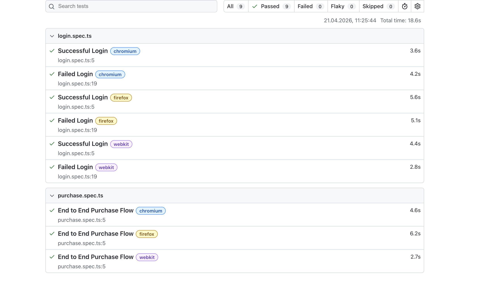
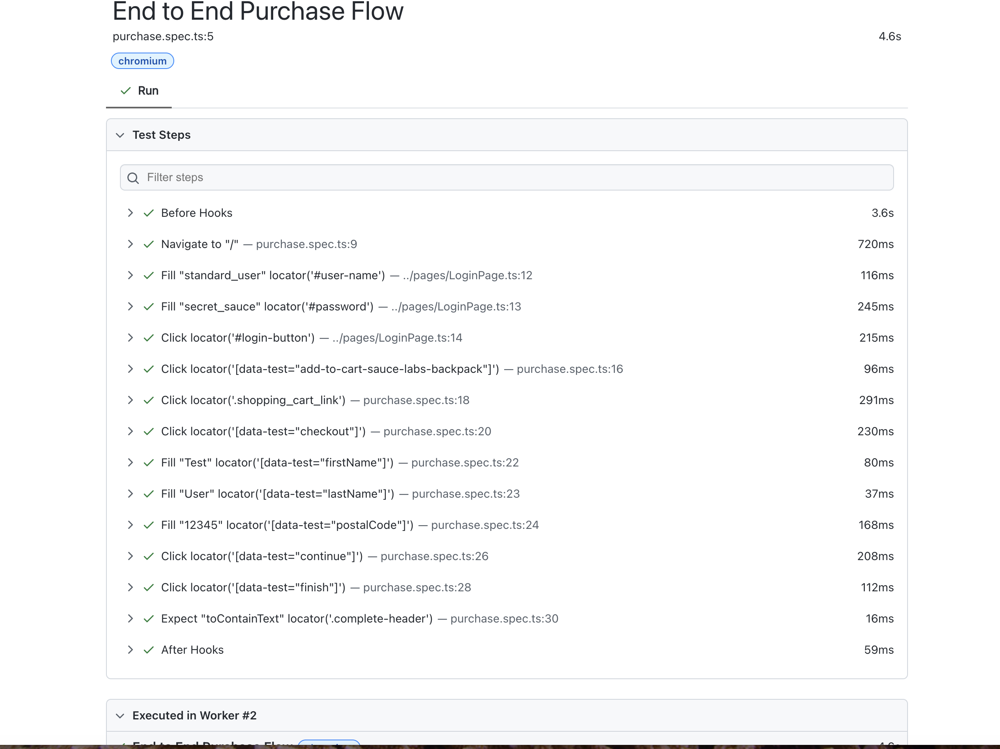

# Playwright Automation Framework

Automation testing project built with Playwright and TypeScript.

## Project Overview

This project demonstrates a modern automation testing framework using:

- Playwright
- TypeScript
- Page Object Model (POM)
- JSON test data fixtures
- UI End-to-End testing
- API testing
- Playwright HTML reporting

Application under test:

https://www.saucedemo.com

API under test:

https://demo.playwright.dev/api-mocking/api/v1/fruits

---

# Project Structure

pages/ – Page Object Model classes
tests/ – UI and API test cases
fixtures/ – test data in JSON format
screenshots/ – report screenshots
playwright.config.ts – Playwright configuration

---

# Running the Tests

## Test Report Screenshots

### Report Overview


### Test Details



Install dependencies:


```bash
npm install
```

Run tests:

```bash
npx playwright test
```

Run tests in headed mode:

```bash
npx playwright test --headed
```

Open HTML report:

```bash
npx playwright show-report
```